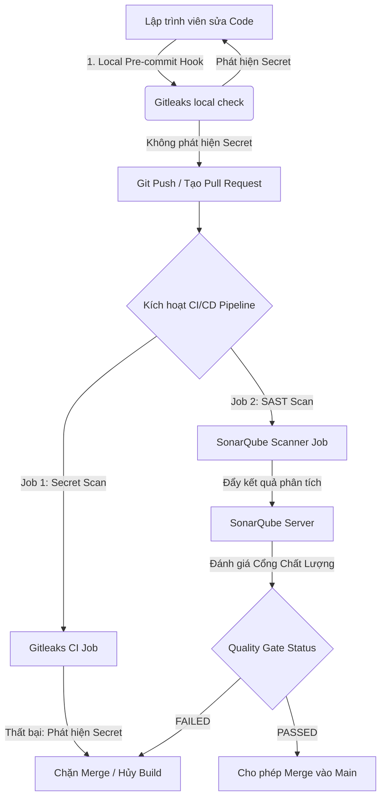

# Hướng Dẫn Triển Khai Thực Tế Giải Pháp CI/CD: SAST & Secret Scanning (SonarQube & Gitleaks)

Để chuyển từ lý thuyết sang thực hành, tài liệu này hướng dẫn chi tiết từng bước cấu hình và triển khai hai công cụ bảo mật hàng đầu: **Gitleaks** (quét mã độc, lộ mật khẩu/keys) và **SonarQube** (phân tích mã nguồn tĩnh SAST, đánh giá chất lượng mã nguồn và áp dụng cổng chất lượng Quality Gates) vào quy trình CI/CD tự động.

---

## 1. Kiến Trúc Luồng Kiểm Tra Bảo Mật Tự Động

Quy trình bảo mật tích hợp được chia thành hai lớp phòng thủ:



1.  **Lớp phòng thủ 1 (Phía Client - Local):** Lập trình viên chạy Gitleaks trước khi commit để chặn đứng việc lộ lọt secret từ máy cá nhân.
2.  **Lớp phòng thủ 2 (Phía Server - CI/CD):** Khi tạo Pull Request, Pipeline chạy song song việc quét secret bằng Gitleaks CI và phân tích lỗ hổng tĩnh SAST bằng SonarQube, chờ phản hồi trạng thái từ Quality Gate để quyết định cho phép gộp mã nguồn hay không.

---

## 2. Triển Khai Chi Tiết Gitleaks (Secret Scanning)

Gitleaks là công cụ mã nguồn mở cực kỳ mạnh mẽ để phát hiện các thông tin nhạy cảm (API Keys, Passwords, Certificates...) trong lịch sử Git.

### 2.1. Cấu hình Local Git Hook (Ngăn chặn trước khi Commit)
Để lập trình viên không bao giờ vô tình commit secret lên máy chủ, hãy cấu hình pre-commit hook.

#### Cách 1: Sử dụng framework `pre-commit` (Khuyên dùng)
1. Cài đặt framework pre-commit:
   ```bash
   pip install pre-commit
   ```
2. Tạo file `.pre-commit-config.yaml` ở thư mục gốc của dự án:
   ```yaml
   repos:
     - repo: https://github.com/gitleaks/gitleaks
       rev: v8.18.2
       hooks:
         - id: gitleaks
   ```
3. Kích hoạt hook:
   ```bash
   pre-commit install
   ```

#### Cách 2: Tự viết script Shell cho Git Hook
Tạo hoặc ghi đè file `.git/hooks/pre-commit` với nội dung sau:
```bash
#!/bin/bash
# Chạy gitleaks kiểm tra các thay đổi chuẩn bị commit
gitleaks protect --staged --verbose
if [ $? -ne 0 ]; then
  echo "❌ [Gitleaks] Phát hiện thông tin nhạy cảm trong mã nguồn của bạn!"
  echo "Vui lòng gỡ bỏ các khóa bảo mật/mật khẩu trước khi commit."
  exit 1
fi
```
*(Đừng quên phân quyền thực thi cho file hook: `chmod +x .git/hooks/pre-commit`)*

---

## 3. Triển Khai Chi Tiết SonarQube (SAST & Quality Gate)

SonarQube đóng vai trò phân tích mã nguồn tĩnh (SAST), tìm kiếm các bug logic, điểm yếu bảo mật (Vulnerabilities), điểm nóng bảo mật cần rà soát (Security Hotspots) và nợ kỹ thuật (Technical Debt).

### 3.1. Khởi chạy nhanh máy chủ SonarQube (Môi trường Dev/Test)
Nếu chưa có hệ thống SonarQube tập trung, bạn có thể dựng nhanh bằng Docker Compose:

Tạo file `docker-compose.yml`:
```yaml
version: '3.8'

services:
  sonarqube:
    image: sonarqube:lts-community
    container_name: sonarqube_server
    ports:
      - "9000:9000"
    volumes:
      - sonarqube_data:/opt/sonarqube/data
      - sonarqube_extensions:/opt/sonarqube/extensions
      - sonarqube_logs:/opt/sonarqube/logs
    environment:
      - SONAR_JDBC_USERNAME=sonar
      - SONAR_JDBC_PASSWORD=sonar
    ulimits:
      nofile:
        soft: 65536
        hard: 65536

volumes:
  sonarqube_data:
  sonarqube_extensions:
  sonarqube_logs:
```
Chạy lệnh: `docker-compose up -d`. Truy cập giao diện tại `http://localhost:9000` (Tài khoản mặc định: `admin` / `admin`).

### 3.2. Cấu hình tệp `sonar-project.properties`
Tạo file cấu hình `sonar-project.properties` tại thư mục gốc của mã nguồn dự án để định cấu hình các tham số quét:

```properties
# Thông tin định danh dự án trên SonarQube Server
sonar.projectKey=my-secure-web-app
sonar.projectName=My Secure Web App
sonar.projectVersion=1.0

# Đường dẫn thư mục mã nguồn cần quét
sonar.sources=.

# Các thư mục/tệp tin loại trừ không quét (thư viện, test, cấu hình)
sonar.exclusions=**/node_modules/**,**/dist/**,**/*.spec.ts,**/coverage/**,**/venv/**

# Khai báo ngôn ngữ chính của dự án (tùy chọn)
sonar.sourceEncoding=UTF-8

# BẮT BUỘC để chặn CI/CD: Chờ SonarQube Server phân tích xong và trả về kết quả Quality Gate
# Nếu Quality Gate thất bại, lệnh quét sẽ trả về exit code khác 0, làm dừng pipeline
sonar.qualitygate.wait=true
```

---

## 4. Tích Hợp Vào Hệ Thống CI/CD Pipeline Thực Tế

Dưới đây là cấu hình hoàn chỉnh cho hai nền tảng CI/CD phổ biến nhất hiện nay: **GitLab CI/CD** và **GitHub Actions**.

### Lựa chọn A: Cấu hình cho GitLab CI/CD (`.gitlab-ci.yml`)

```yaml
stages:
  - security_scan
  - sast_scan

variables:
  # Địa chỉ máy chủ SonarQube của doanh nghiệp
  SONAR_HOST_URL: "http://sonarqube.mycompany.com:9000"
  # Token bảo mật của dự án SonarQube (được cấu hình trong CI/CD Variables của GitLab)
  # SONAR_TOKEN: "sqp_xxxxxxxxxxxxxxxxxxxxxx"

# ---------------------------------------------------
# STAGE 1: SECRET SCANNING WITH GITLEAKS
# ---------------------------------------------------
gitleaks_scan:
  stage: security_scan
  image: 
    name: zricethezav/gitleaks:latest
    entrypoint: [""]
  script:
    # Quét toàn bộ lịch sử commit trong luồng Pull/Merge Request
    - gitleaks detect --verbose --source=$CI_PROJECT_DIR --redact
  allow_failure: false # Nếu phát hiện secret, pipeline sẽ bị dừng ngay lập tức
  rules:
    - if: $CI_PIPELINE_SOURCE == 'merge_request_event'
    - if: $CI_COMMIT_BRANCH == 'main'

# ---------------------------------------------------
# STAGE 2: SAST SCANNING WITH SONARQUBE
# ---------------------------------------------------
sonarqube_sast:
  stage: sast_scan
  image:
    name: sonarsource/sonar-scanner-cli:latest
    entrypoint: [""]
  cache:
    key: "${CI_COMMIT_REF_SLUG}"
    paths:
      - .sonar/cache
  script:
    # Thực hiện lệnh quét
    # Biến SONAR_TOKEN và SONAR_HOST_URL sẽ được sonar-scanner tự động nhận diện từ môi trường
    - sonar-scanner 
        -Dsonar.token=$SONAR_TOKEN 
        -Dsonar.host.url=$SONAR_HOST_URL
  allow_failure: false # Nếu kết quả Quality Gate FAILED, pipeline sẽ báo đỏ và chặn Merge
  rules:
    - if: $CI_PIPELINE_SOURCE == 'merge_request_event'
    - if: $CI_COMMIT_BRANCH == 'main'
```

---

### Lựa chọn B: Cấu hình cho GitHub Actions (`.github/workflows/security.yml`)

```yaml
name: Security Pipeline (SAST & Secret Scan)

on:
  push:
    branches: [ "main", "develop" ]
  pull_request:
    branches: [ "main", "develop" ]

jobs:
  # ---------------------------------------------------
  # JOB 1: GITLEAKS SECRET SCANNING
  # ---------------------------------------------------
  secret-scanning:
    name: Gitleaks Secret Scan
    runs-on: ubuntu-latest
    steps:
      - name: Checkout Code
        uses: actions/checkout@v4
        with:
          fetch-depth: 0 # Bắt buộc lấy toàn bộ lịch sử git để quét lịch sử commit

      - name: Run Gitleaks Action
        uses: gitleaks/gitleaks-action@v2
        env:
          GITHUB_TOKEN: ${{ secrets.GITHUB_TOKEN }}
          # Bạn có thể lưu trữ báo cáo phát hiện secret tại đây
        with:
          args: detect --verbose --redact

  # ---------------------------------------------------
  # JOB 2: SONARQUBE SAST ANALYSIS
  # ---------------------------------------------------
  sonarqube-sast:
    name: SonarQube SAST & Quality Gate
    runs-on: ubuntu-latest
    needs: secret-scanning # Chỉ chạy SonarQube sau khi đã xác nhận không có Secret lộ lọt
    steps:
      - name: Checkout Code
        uses: actions/checkout@v4
        with:
          fetch-depth: 0 # SonarQube cần lịch sử git để tính toán tác giả dòng code (blame)

      - name: Run SonarQube Scanner
        uses: SonarSource/sonarqube-scan-action@v2
        env:
          SONAR_TOKEN: ${{ secrets.SONAR_TOKEN }}
          SONAR_HOST_URL: ${{ secrets.SONAR_HOST_URL }}
        with:
          # Các cấu hình bổ sung có thể truyền trực tiếp ở đây thay vì file properties
          args: >
            -Dsonar.projectKey=my-secure-web-app
            -Dsonar.qualitygate.wait=true

      # Bước kiểm tra trạng thái Quality Gate và quyết định dừng build
      - name: SonarQube Quality Gate Check
        uses: SonarSource/sonarqube-quality-gate-action@v1
        timeout-minutes: 5
        env:
          SONAR_TOKEN: ${{ secrets.SONAR_TOKEN }}
```

---

## 5. Kinh Nghiệm Vận Hành & Khắc Phục Lỗi Thực Tế

### 5.1. Xử lý "Cảnh báo giả" (False Positives)

Không có công cụ quét tự động nào là chính xác 100%. Lập trình viên và kiểm toán viên cần có phương án xử lý các cảnh báo giả một cách khoa học:

*   **Đối với Gitleaks:** 
    Nếu Gitleaks báo lỗi đối với một chuỗi ký tự ngẫu nhiên trong mã kiểm thử (ví dụ chuỗi mock-test key), bạn có thể cấu hình file `.gitleaksignore` tại thư mục gốc để bỏ qua:
    ```text
    # Thêm vân tay (fingerprint) của cảnh báo giả do gitleaks xuất ra
    6c483a992850982cfc7a7b8eef2f9a904e22cc3b
    ```
*   **Đối với SonarQube:**
    Không nên xóa code chỉ để chiều ý công cụ. Trên giao diện SonarQube Dashboard:
    1. Click vào lỗ hổng bị báo sai.
    2. Chuyển trạng thái từ **Open** thành **False Positive** hoặc **Won't Fix**.
    3. Điền lý do giải trình cụ thể. Hệ thống sẽ tự động bỏ qua lỗi này trong các lần quét tiếp theo.

### 5.2. Cách tối ưu hóa thời gian chạy Pipeline

*   **Quét nông (Shallow Scan):** Đối với các nhánh tính năng (Feature branches), chỉ cấu hình SonarQube quét các file thay đổi (Incremental analysis) thay vì quét toàn bộ hệ thống để giảm thời gian phản hồi từ 15 phút xuống dưới 2 phút.
*   **Sử dụng Cache:** Lưu trữ thư mục `.sonar/cache` giữa các lần build trong cấu hình CI/CD để tránh việc tải lại các bộ thư viện phân tích của SonarQube.

## 6. Kết Luận

Việc áp dụng cặp đôi **Gitleaks & SonarQube** vào hệ thống CI/CD là giải pháp toàn diện và tối ưu chi phí nhất đối với các doanh nghiệp công nghệ hiện nay. Bằng cách chặn đứng mã chứa khóa bí mật ngay từ máy lập trình viên (với pre-commit hook) và liên tục rà soát kiểm tra chất lượng an toàn mã nguồn ở mỗi Pull Request (với SonarQube Quality Gates), hệ thống của bạn sẽ được bảo vệ một cách chủ động và tự động hóa hoàn toàn.
