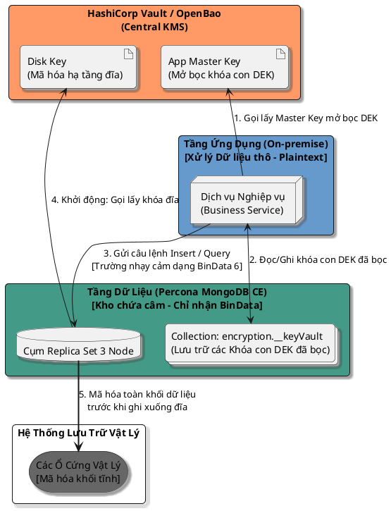
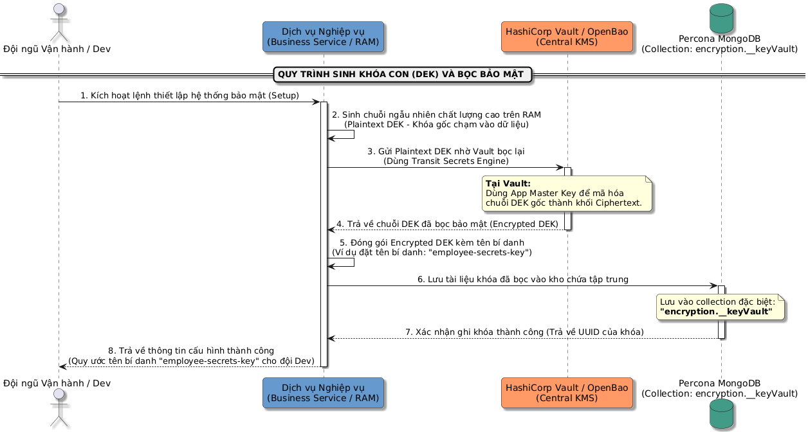
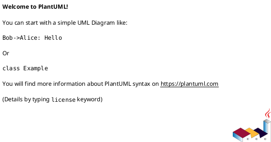
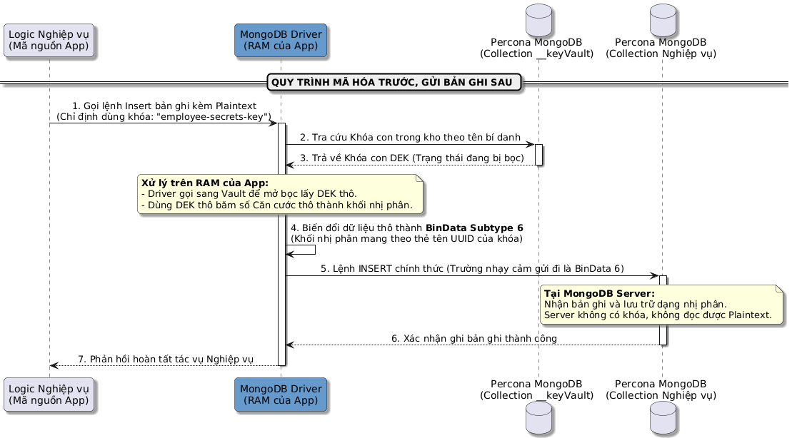
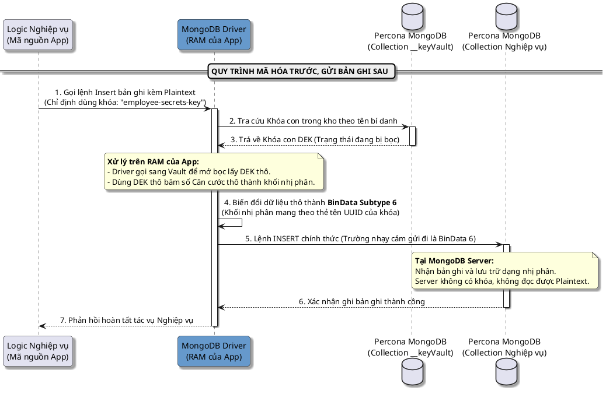
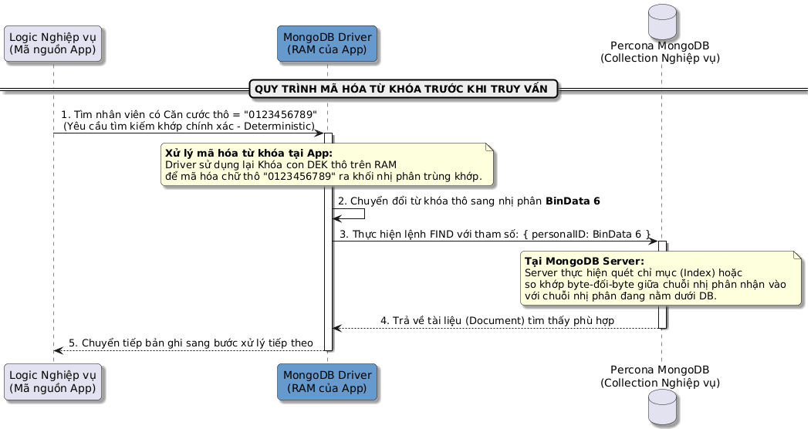
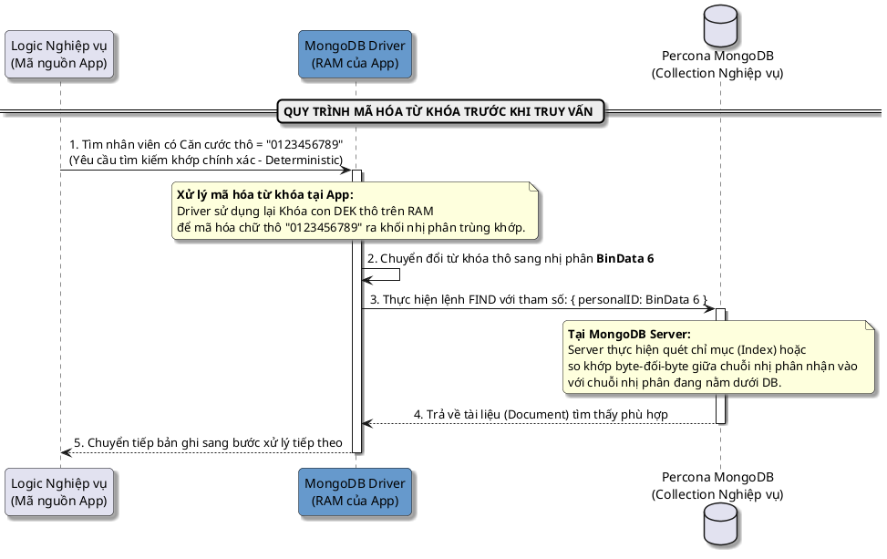
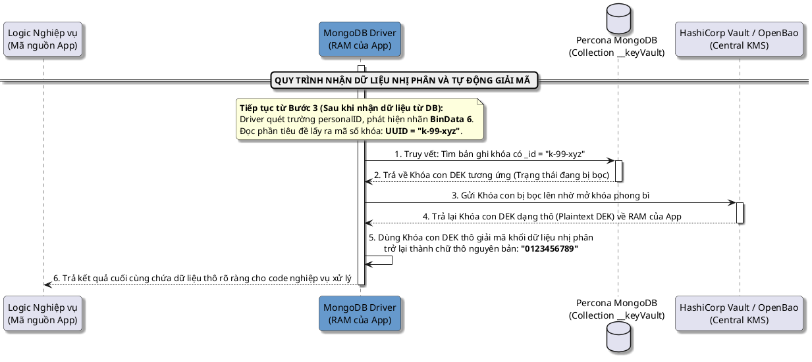
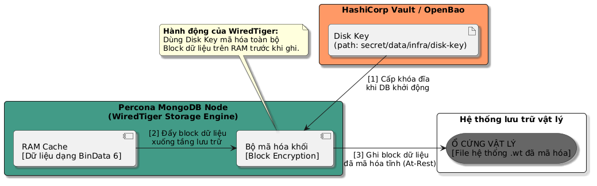
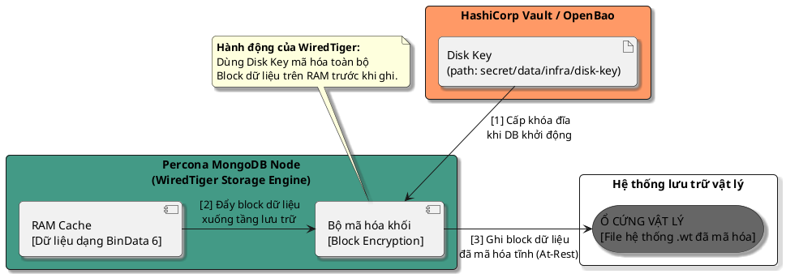

# **TÀI LIỆU KIẾN TRÚC TỔNG QUÁT: BẢO MẬT DỮ LIỆU ĐA TẦNG (DATA SECURITY ARCHITECTURE)**

*Tài liệu này áp dụng với công nghệ Hashicop Vault và Percona MongoDB CE*

## **I\. TỔNG QUAN KIẾN TRÚC (ARCHITECTURE OVERVIEW)**

Hệ thống áp dụng mô hình bảo mật **"Zero-Trust Data"** bằng cách kết hợp hai giải pháp mã hóa độc lập để bảo vệ dữ liệu ở mọi trạng thái:

1. **Mã hóa cấp trường phía khách (CSFLE):** Thực hiện tại tầng **Dịch vụ Nghiệp vụ (Business Service)**. Dữ liệu nhạy cảm được mã hóa trước khi truyền qua mạng và ghi vào DB. Chống rò rỉ dữ liệu ngay cả khi Quản trị viên DB (DBA) hoặc Hacker chiếm được quyền root của hệ quản trị cơ sở dữ liệu.  
2. **Mã hóa dữ liệu tĩnh (Data-at-Rest Encryption):** Thực hiện tại tầng Lưu trữ (Storage Engine) của Percona MongoDB. Toàn bộ file dữ liệu vật lý lưu trên ổ cứng sẽ được mã hóa, chống rò rỉ dữ liệu khi bị đánh cắp ổ đĩa vật lý hoặc sao chép trộm file database.

Tất cả các khóa mẹ (Master Keys) điều khiển hai tính năng trên được quản lý tập trung và nghiêm ngặt tại cụm **HashiCorp Vault**.

## **II\. THIẾT KẾ CHI TIẾT**

### 1. **Mã hóa cấp trường phía khách (CSFLE):**

#### 1.1. **Khởi tạo và sinh khóa con (DEK Generation)**
Trước khi ứng dụng có thể mã hóa dữ liệu, nó tự sinh ra con ngẫu nhiên (Plaintext DEK), gửi lên Vault để bọc bảo mật bằng Master Key, sau đó lưu vào bộ lưu trữ tập trung của MongoDB dưới dạng đã bọc (Encrypted DEK).

#### 1.2. **Mã hóa và ghi mới dữ liệu (CSFLE Insert Data)**

Khi thực hiện ghi bản ghi mới, Dịch vụ Nghiệp vụ tìm khóa con bằng tên bí danh, mã hóa trường thông tin nhạy cảm thành chuỗi nhị phân BinData Subtype 6 trên RAM rồi mới đẩy câu lệnh qua mạng tới MongoDB.

#### 1.3. **Mã hóa giá trị tìm kiếm (CSFLE Query / Find Data)**

Do dữ liệu dưới database là chuỗi nhị phân, ứng dụng không thể tìm kiếm theo dạng chữ thô. Nó buộc phải mã hóa từ khóa tìm kiếm thành dạng nhị phân tương ứng (sử dụng thuật toán Deterministic) trước khi gửi truy vấn sang MongoDB Server để thực hiện so khớp byte-đối-byte.

#### 1.4. **Giải mã và trả về dữ liệu (CSFLE Read Data)**

Khi nhận khối nhị phân đổ về từ MongoDB, Driver chạy trên RAM của ứng dụng tự động bóc tách tiêu đề dữ liệu để lấy mã UUID (Key ID), tìm đúng bản ghi khóa con trong __keyVault, gửi sang Vault mở bọc và dịch ngược dữ liệu về chữ thô ban đầu.

### 2. Data-at-Rest Encryption (Mã hóa dữ liệu tĩnh) 

Tầng lưu trữ WiredTiger của Percona MongoDB kết nối trực tiếp đến Vault để lấy Disk Key khi khởi động cụm. Quá trình đồng bộ hóa giữa các node Secondary vẫn giữ nguyên trạng thái nhị phân, và hành động mã hóa đĩa diễn ra ngay trước khi các block dữ liệu được đổ xuống ổ cứng vật lý.

